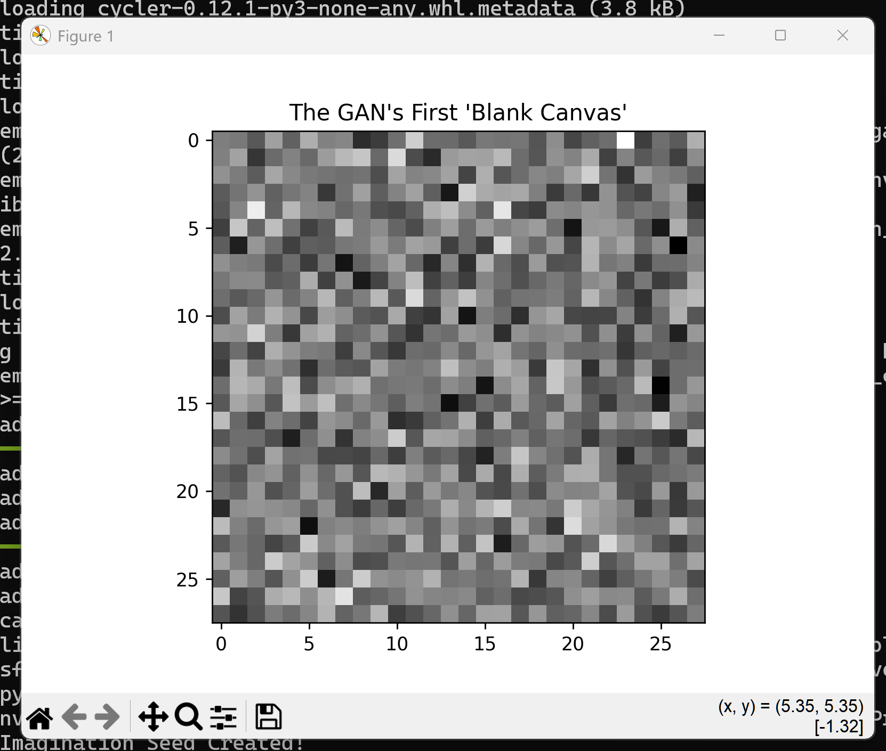
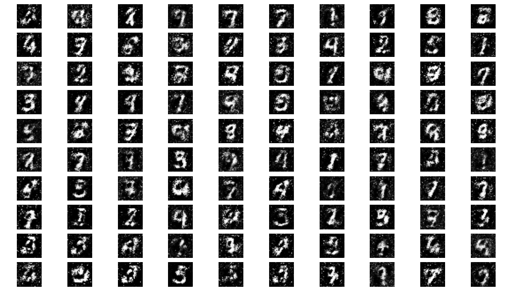
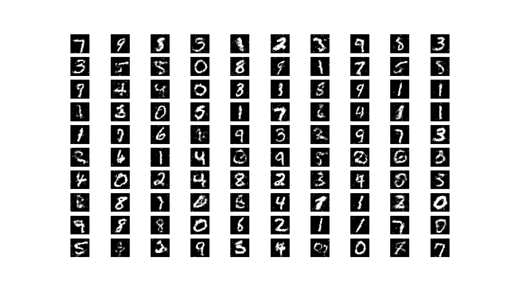
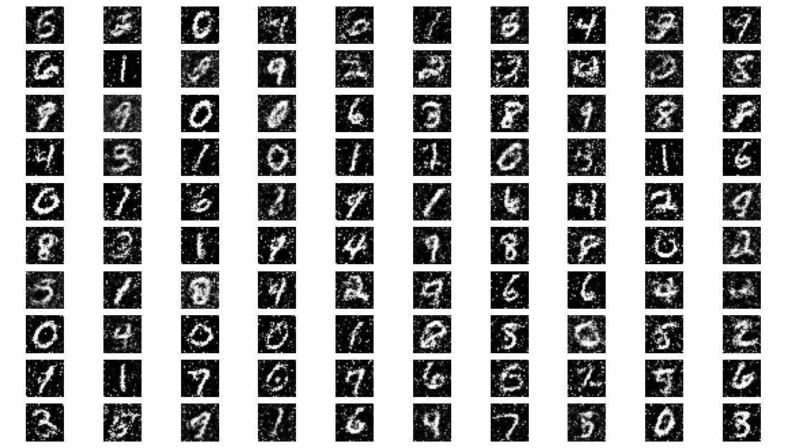

# MNIST GAN - Handwritten Digit Generator

This project implements a Generative Adversarial Network (GAN) trained on the
MNIST dataset to generate realistic handwritten digit images from random noise.
Built with TensorFlow and Keras, the project demonstrates a full GAN training
pipeline including advanced stabilization techniques.

---

## Project Summary

A GAN consists of two competing neural networks — a Generator that learns to
create convincing fake images, and a Discriminator that learns to tell real
images from fake ones. Through adversarial training, both networks improve
together until the Generator can produce images that are nearly indistinguishable
from real handwritten digits.

The goal of this project is to demonstrate a working GAN pipeline from initial
random noise through to a fully trained image generator, with clear visual
evidence of the learning progression.

---

## Learning Progression

### Stage 1 - The Blank Canvas (Untrained)
The generator starts with pure random noise and has no understanding of what
a digit looks like.



---

### Stage 2 - First 10 Epochs
Digit shapes begin to emerge but are blurry and noisy.



---

### Stage 3 - 50 Epochs
Digits are clearly recognizable and well formed. The generator has learned
the core structure of handwritten numbers.



---

### Stage 4 - 100 Epochs
Digits remain readable with some texture variation, demonstrating the
model's ability to generate diverse outputs.



---

## Features

- **Full GAN Training Pipeline** — End-to-end implementation from data loading
  through model training to image generation.
- **Label Smoothing** — Applies soft labels to both real and fake training
  samples to improve GAN stability.
- **Instance Noise** — Adds controlled noise to training images to prevent
  the discriminator from becoming overconfident.
- **Batch Normalization** — Applied across all generator layers to stabilize
  and accelerate training.
- **Dropout Regularization** — Applied in the discriminator to prevent
  overfitting to real images.
- **Saved Trained Model** — The trained generator is saved as an H5 file for
  reuse and deployment.
- **Concept Demonstration Script** — A standalone battle report script that
  illustrates the Generator vs Discriminator dynamic before full training.

---

## Tech Stack

- Python
- TensorFlow / Keras
- NumPy
- Matplotlib
- Conda

---

## How It Works

1. MNIST image data is loaded and normalized to a range of -1 to 1.
2. The Generator network takes 100-dimensional random noise as input and
   produces a 28x28 pixel image.
3. The Discriminator network takes a 28x28 image and predicts whether it
   is real or generated.
4. Both networks are trained together in an adversarial loop — the Generator
   tries to fool the Discriminator while the Discriminator tries to catch fakes.
5. Advanced stabilization techniques including label smoothing and instance
   noise are applied during training.
6. After training, the Generator is saved and used to produce a final grid
   of generated digit images.

---

## Model Architecture

### Generator
- Input: 100-dimensional noise vector
- Progressive layer growth: 256 → 512 → 1024 units
- LeakyReLU activation with BatchNormalization at each layer
- Output: 28x28x1 image with tanh activation

### Discriminator
- Input: 28x28x1 image
- Flattened and passed through: 512 → 256 units
- LeakyReLU activation with Dropout at each layer
- Output: Single sigmoid unit (Real or Fake)

---

## What I Built

In this project, I:

- Designed and implemented a full GAN architecture using TensorFlow and Keras
- Applied advanced GAN stabilization techniques including label smoothing,
  instance noise, and batch normalization
- Documented the visual learning progression from random noise to recognizable
  digits across training epochs
- Saved a trained generator model for reuse and future deployment
- Created a standalone concept demonstration script illustrating the
  adversarial dynamic between Generator and Discriminator

---

## Installation and Setup

### 1. Clone the Repository
```bash
git clone https://github.com/jdkipp-AI/MNIST-GAN.git
cd MNIST-GAN
2. Create and Activate Conda Environment
bash
conda create -n gan_env python=3.10
conda activate gan_env
3. Install Dependencies
bash
pip install -r requirements.txt
4. Run the Concept Demo
bash
python gan_battle.py
5. Run Full Training
bash
python gan_fake_image_final.py
Future Enhancements
Implement a Convolutional GAN (DCGAN) for higher quality image output
Add a loss history plot to visualize training stability over time
Extend to conditional GAN (cGAN) to generate specific digit classes on demand
Train on more complex datasets such as CIFAR-10 or custom image sets
Build an interactive interface to generate images on demand
Why This Project Matters
Generative Adversarial Networks are one of the foundational architectures in
modern generative AI. This project demonstrates a working implementation with
production-level considerations such as training stability, model persistence,
and clear documentation of results. It serves as a practical foundation for
more advanced generative AI work.

Author
James D. Kipp — Quality and Data Specialist transitioning into AI
GitHub: https://github.com/jdkipp-AI
